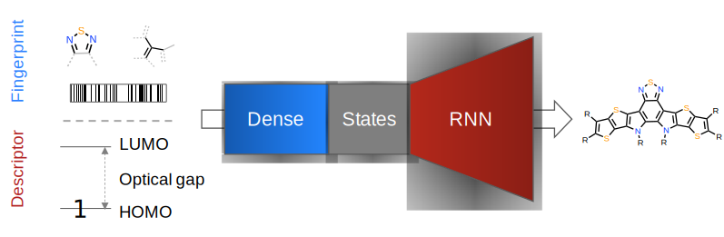

# Designing organic photoelectronic molecules with descriptor conditional recurrent neural networks
[](https://opensource.org/licenses/MIT) [](https://doi.org/10.5281/zenodo.4073289) [](https://www.python.org/downloads/release/python-367/) [](https://github.com/ellerbrock/open-source-badges/) 

___

Code for the purposes of [Designing organic photoelectronic molecules with descriptor conditional recurrent neural networks](https://github.com/learningmatter-mit/Deep-Drug-Coder)

Deep generative models can be trained on unlabeled chemical data to design novel molecules, but harnessing the creativity of such models for finding optimal molecules is a challenge. In their recent work on [Direct Steering of de novo Molecular Generation using Descriptor Conditional Recurrent Neural Networks (cRNNs)](https://www.nature.com/articles/s42256-020-0174-5), Bjerrum and colleagues present a generative framework based on cRNNs to translate from a desired property to a string-based chemical representation in the context of drug design. Here, we replicate the approach on an unrelated chemical space by designing organic photoelectronic molecules (OPMs) with properties outside the training data.

___

The code has been repurposed from [Deep-Drug-Coder](https://github.com/pcko1/Deep-Drug-Coder/tree/nightly).

The chemical structures and labels used for training and validation of the supervised and unsupervised models, with the exception of 684 proprietary molecules have been shared in the folder [datasets](https://github.com/learningmatter-mit/Deep-Drug-Coder/tree/nightly/datasets/OPD_Data).

The notebooks used for training of the OPM cRNN models have been prepended with OPM.

<p align="center">
  
</p>

___

### Custom Dependencies
- [TensorFlow >=2.0](https://www.tensorflow.org/)
- [molvecgen](https://github.com/EBjerrum/molvecgen)

### Installation
- Install `git-lfs` as instructed [here](https://github.com/git-lfs/git-lfs/wiki/Installation). This is necessary in order to download the datasets.
- Clone the repo and navigate to it.
- Create a predefined Python3.6 conda environment by `conda env create -f env/ddc_env.yml`. This ensures that you have the correct version of `rdKit` and `cudatoolkit`.
- Run `pip install .` to install remaining dependencies and add the package to the Python path.
- Add the environment in the drop-down list of jupyter by `python -m ipykernel install --user --name ddc_env --display-name "ddc_env (python_3.6.7)"`.

### Usage
``` bash
conda activate ddc_env
```

```python
from ddc_pub import ddc_v3 as ddc
```

### API
- `fit()`: Fit a DDC model to the dataset.
- `vectorize()`: Convert a binary RDKit molecule to its One-Hot-Encoded representation.
- `transform()`: Encode a vectorized molecule to its latent representation.
- `predict()`: Decode a latent representation into a SMILES string and return its Negative Log Likelihood (NLL).
- `predict_batch()`: Decode a list of latent representations into SMILES strings and return their NLLs.
- `get_smiles_nll()`: Back-calculate the NLL of a known SMILES string, if it was to be sampled by the biased decoder.
- `get_smiles_nll_batch()`: Back-calculate the NLLs of a batch of known SMILES strings, if they were to be sampled by the biased decoder.
- `summary()`: Display essential architectural parameters.
- `get_graphs()`: Export model graphs to .png files using `pydot` and `graphviz` ([might fail](https://github.com/AppliedDataSciencePartners/DeepReinforcementLearning/issues/3)).
- `save()`: Save the model in a .zip directory.
